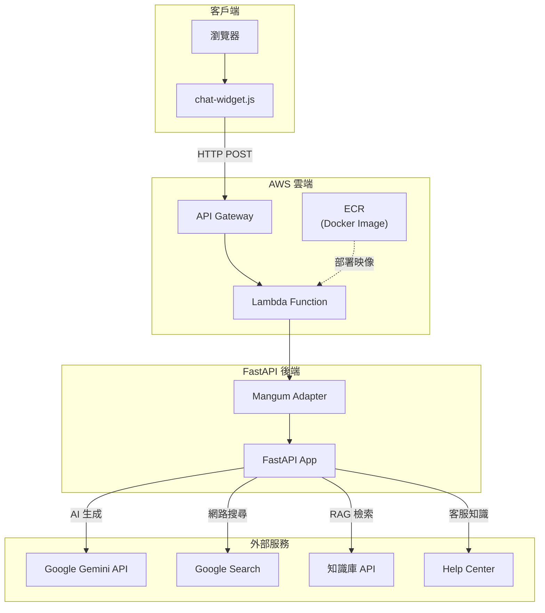
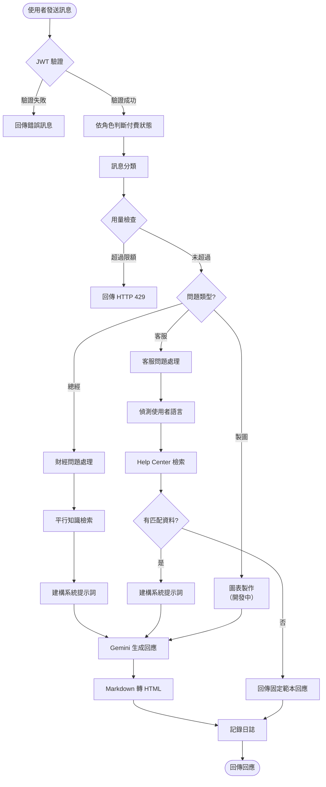
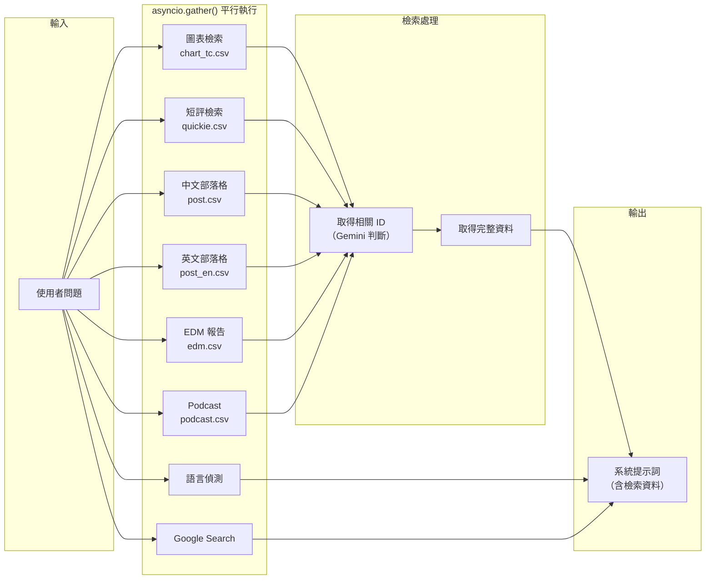
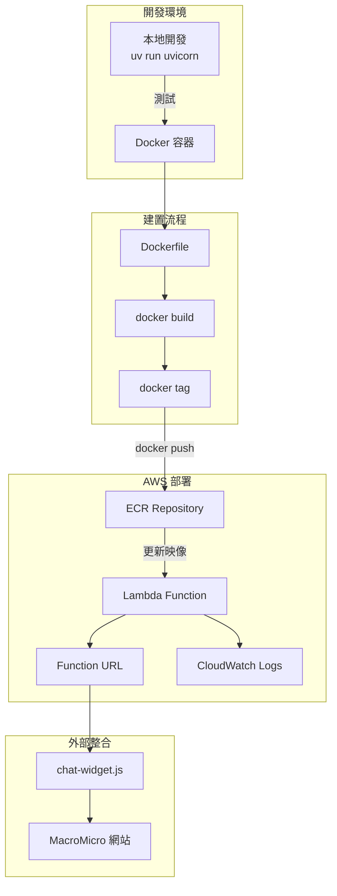
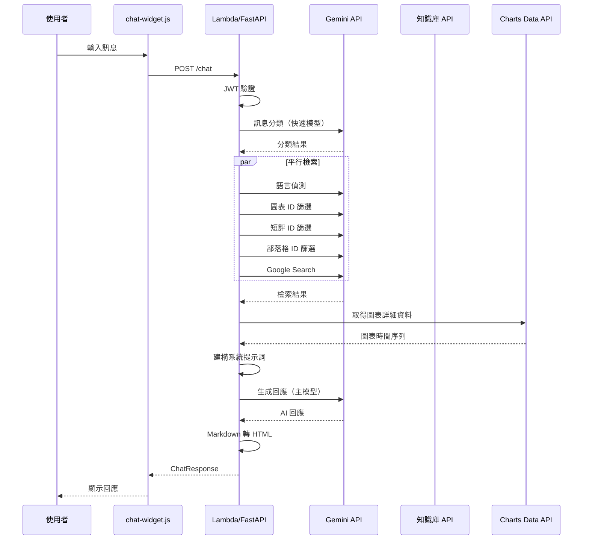
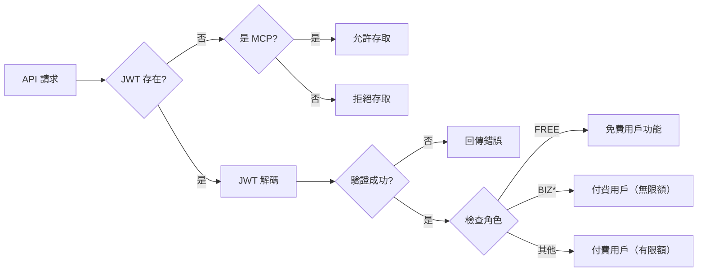

# MM Madam 系統架構

本文件說明 MM Madam AI 聊天機器人的系統架構與運作流程。

## 目錄
- [系統整體架構](#系統整體架構)
- [聊天請求處理流程](#聊天請求處理流程)
- [平行知識檢索流程](#平行知識檢索流程)
- [部署架構](#部署架構)
- [資料流說明](#資料流說明)

---

## 系統整體架構



### 元件說明

| 元件 | 技術 | 說明 |
|-----|------|------|
| chat-widget.js | JavaScript | 可嵌入式聊天視窗，整合於 MacroMicro 網站 |
| API Gateway | AWS | 處理 HTTPS 請求與 CORS |
| Lambda | AWS | 無伺服器運算，執行 Docker 容器 |
| FastAPI | Python | Web API 框架，處理聊天邏輯 |
| Mangum | Python | Lambda 與 FastAPI 的橋接器 |
| Gemini | Google | 大型語言模型，用於 AI 生成與知識檢索 |

### 回應模式

系統支援兩種回應模式：

| 端點 | 模式 | 說明 |
|-----|------|------|
| `POST /chat` | 同步 | 等待完整回應後一次回傳 |
| `POST /chat-stream` | 串流（SSE） | 使用 Server-Sent Events 即時回傳，需 Lambda RESPONSE_STREAM 模式 |

---

## 聊天請求處理流程



### 處理階段說明

1. **JWT 驗證**
   - 驗證使用者身份
   - 依 JWT role 判斷付費狀態（FREE→免費用戶，BIZ*→付費，其他→付費）
   - 驗證失敗則回傳錯誤訊息

2. **訊息分類**
   - 使用 Gemini 快速判斷問題類型
   - 分為「總經」、「客服」、「製圖」三類

3. **知識檢索（RAG）**
   - 財經問題：平行檢索多個知識庫
   - 客服問題：檢索 Help Center，若無匹配資料則跳過 Gemini，直接回傳固定範本回應（依語言 tc/sc/en）

4. **用量檢查**
   - 訊息分類後、知識檢索前，呼叫 Usage API 檢查用量
   - 超過限額回傳 HTTP 429
   - Usage API 異常時放行（fail open）
   - MCP 請求（user_id 101001000）不受限
   - 用量限制由 Google Sheet 管理（`USAGE_LIMITS_URL`），每 5 分鐘自動刷新，無需重新部署

5. **回應生成**
   - 根據系統提示詞與檢索結果生成回應
   - 支援 Thinking Budget 控制推理深度

5. **格式轉換**
   - 轉換 Markdown 為 HTML
   - 圖表預覽圖片由系統提示詞指示 AI 直接在回應中嵌入

---

## 平行知識檢索流程



### 檢索流程說明

每個知識庫的檢索流程：

1. **ID 篩選階段**
   - 將知識庫的前兩欄（ID + 標題）傳給 Gemini
   - Gemini 回傳最相關的 N 個 ID（預設 5 個）

2. **資料取得階段**
   - 根據 ID 取得完整資料
   - 圖表資料額外透過 Charts Data API 取得時間序列

3. **平行執行**
   - 所有檢索任務透過 `asyncio.gather()` 同時執行
   - 大幅減少等待時間

4. **知識庫載入**
   - CSV 知識庫資料於 Lambda 冷啟動時同步載入（使用 `httpx.Client`，相容 Lambda 事件迴圈），並透過 TTL 快取（1 小時）定期刷新
   - Podcast 資料透過 gdown 獨立下載，失敗不影響其他知識庫

### 知識庫資料結構

| 知識庫 | 欄位 | 來源 |
|--------|------|------|
| chart_tc | id, name_tc, slug, description, series | Charts Data API |
| quickie | id, title, content, date | Knowledge CSV API |
| post | id, slug, title, markdown, date | Knowledge CSV API |
| edm | id, title, markdown, date | Knowledge CSV API |
| podcast | id, title, date, markdown | Google Drive (gdown) |

---

## 部署架構



### 部署指令

```bash
# 完整部署流程
./aws-docker.sh

# 或手動執行
aws ecr get-login-password --region ap-northeast-1 | \
  docker login --username AWS --password-stdin <account>.dkr.ecr.ap-northeast-1.amazonaws.com

docker build -t mm-madam .
docker tag mm-madam:latest <account>.dkr.ecr.ap-northeast-1.amazonaws.com/mm-madam:latest
docker push <account>.dkr.ecr.ap-northeast-1.amazonaws.com/mm-madam:latest
```

### Lambda 設定

| 設定項目 | 建議值 | 說明 |
|---------|-------|------|
| Memory | 1024 MB+ | 足夠的記憶體以處理知識庫 |
| Timeout | 60-120s | 預留足夠的 AI 回應時間 |
| Invoke Mode | RESPONSE_STREAM | 支援串流回應（選用） |

---

## 資料流說明

### 完整請求-回應流程



### Token 使用與成本追蹤

系統內建 `TokenCounter` 類別，追蹤每次請求的 token 使用：

```
prompt_token_count      # 輸入 token 數
candidates_token_count  # 輸出 token 數
cached_content_token_count  # 快取 token 數
thoughts_token_count    # 思考 token 數
total_token_count      # 總計 token 數
```

成本計算公式：
```
cost = (input × rate_input + output × rate_output + thinking × rate_thinking + cache × rate_cache) / 1,000,000
```

---

## 安全性考量

### JWT 驗證流程



### CORS 白名單

僅允許以下來源存取 API：
- `https://www.macromicro.me`
- `https://sc.macromicro.me`
- `https://en.macromicro.me`
- `https://dev.macromicro.me`
- `https://debug.macromicro.me`
- 及對應的 CMS 子網域

---

## 效能優化

1. **平行知識檢索**
   - 使用 `asyncio.gather()` 同時執行多個檢索任務
   - 減少整體等待時間

2. **快取機制**
   - 系統提示詞、行銷提示詞、用量限制使用 TTL 快取（5 分鐘自動刷新）
   - 知識庫資料使用 TTL 快取（1 小時自動刷新），冷啟動時預先載入（使用 httpx 同步客戶端，避免 Lambda 事件迴圈衝突）

3. **HTTP 連線池**
   - 使用 `httpx.AsyncClient` 管理非同步 HTTP 請求
   - 重複使用連線減少延遲

4. **Token 預算控制**
   - 透過 `thinking_budget` 控制 Gemini 思考深度
   - 平衡回應品質與成本
